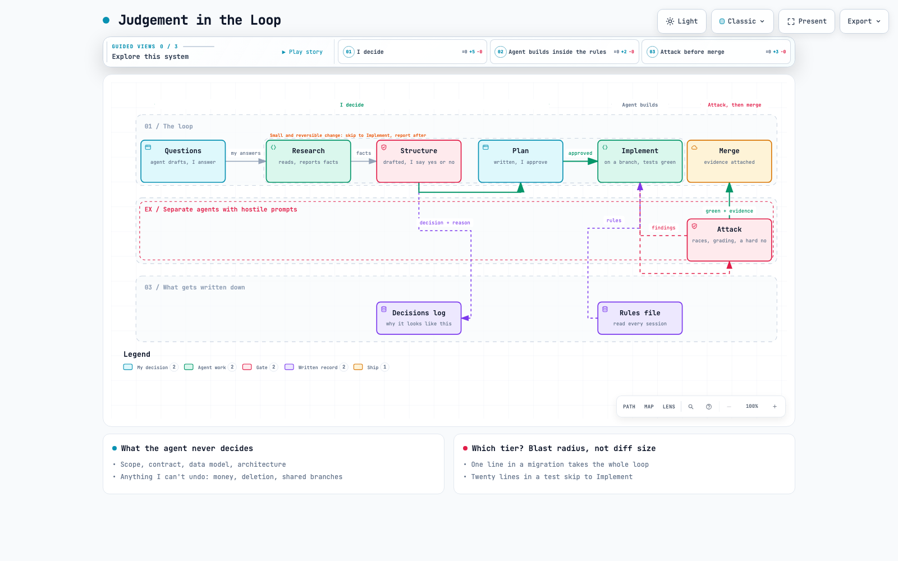

# Judgement in the Loop

How I build software with an AI coding agent while keeping the decisions.

The base is [QRSPI](https://github.com/matanshavit/qrspi) by Matan Shavit: Questions, Research, Structure, Plan, Implement. QRSPI grew out of Dex Horthy's Research, Plan, Implement. I didn't invent the phases. I added four things around them: a rules file the agent reads every session, a checkpoint I don't skip, adversarial agents before every merge, and a rule for when the full loop applies.

Interactive version: [docs/judgement-in-the-loop.html](docs/judgement-in-the-loop.html). Open the file in a browser. Made with [archify](https://github.com/tt-a1i/archify); the source is in [docs/judgement-in-the-loop.json](docs/judgement-in-the-loop.json).

## How it started

July 2026. I was building a meal-planning app that talks to a real grocery basket, partly because I wanted it and partly to learn how a product manager should build with an agent. I asked the agent to design and implement the database schema, and it did both in one go. The schema was fine.

A few weeks later I asked for an MCP layer so the agent could act on the app more autonomously, and I realised I couldn't edit a list item in the app I'd already had it build. I had let implementation run ahead of structure several times without noticing. The schema being fine had been luck. I'd never looked at the data model before it existed.

The agent's code was good. The problem was that I'd stopped noticing where the decisions were being made.

## What I believe

AI should remove friction. Reading library source, migration guides and existing code before touching anything is friction, and I don't need to be in the loop for it. Deciding the shape of a data model, the trade-off in an algorithm, or what a feature should do is judgement, and judgement is the part of my job that doesn't transfer to the agent, however good its output looks.

## The loop

| Phase | Who owns it | Why |
|---|---|---|
| **Questions** | Agent drafts, I answer | If a question can be answered by reading more code, it's research with the wrong label. Real questions are mine: the stack, the scope, the design direction. |
| **Research** | Agent, on its own | Breadth reading is where the agent is faster than my oversight would be useful. It reports facts and keeps its implementation opinions for later. |
| **Structure** | Agent drafts, I validate before it continues | This is the gate that was missing in July. Architecture and behaviour are mine to own, even when the draft is probably right. |
| **Plan** | Agent writes, I approve or redirect | A written plan is cheap to correct. A component tree isn't. |
| **Implement** | Agent, on its own, inside the rules file | Tests, the build and a real check that it works happen inside this step. |
| **Attack** | Adversarial agents with a target | Each one gets a job: find races, grade the result against the brief, edit the docs for plain language. Findings go back to Implement. Green with evidence goes to main. |

There are two tiers. A small, reversible change (a bug fix, a one-line correction, anything cheap to notice and cheap to undo) runs Research and Implement on its own and reports afterwards. Anything that touches a data model, a contract, an architecture or a real feature goes through the whole loop. I choose the tier by how reversible the change is and how far the damage would reach. The size of the diff doesn't come into it: one line in a migration takes the full loop, and twenty lines in a test don't.

Some things override both tiers every time: real money or orders, deleting real data, pushing to anything shared, credentials, and anything I can't undo.

## What a take-home test added

September 2026, a take-home for a Product Engineer role at a large retailer: a supplier lifecycle API from an OpenAPI contract, a dashboard, one-command boot, five days. It was the first time I ran the loop end to end under time pressure. Three things became rules.

**The rules file.** Before any code I wrote fourteen rules in a `CLAUDE.md` that the agent reads at the start of every session. The contract is read-only. Deliver the brief before any extra. Docker only. The domain imports no framework. Locks are always taken in the same order. Every business rule maps to a test named after it. Errors have one shape. One feature per branch, nothing straight to main. I never had to repeat any of them, and when the agent wanted to do something outside them it said so and asked. The file shipped with the delivery so the reviewers could see the contract I had with the agent. A lightly anonymised copy is in [examples/rules-file.md](examples/rules-file.md).

**Attack before merge.** Once the required scope was done I gave separate agents adversarial prompts. One looked for race conditions. One graded the work against the brief using the recruiter's own tips. One reviewed it as a tech lead who wanted to say no. One edited the docs for plain language. The races prompt found two real bugs I'd read past: applying and refusing on the same candidate at the same time could leave a refused candidacy next to a live supplier, and accepting and banning in the same country could deadlock. Both became locks taken in a fixed order, with tests that race the requests. The tech-lead prompt produced three push-backs I then prepared answers for. I wouldn't have found any of it by reading my own code again.

**Verified means verified.** The agent rounds up. It says "done" when something is verified up to a point. Once a merge went through with a failing test because a grep had hidden the exit code, so now the exit code is checked explicitly before every merge. After I'd submitted, an emulated Intel boot failed with an error that looked like a missing platform in a Docker image. The real cause was a cached image on my laptop. I want evidence before I say "done", and evidence before I say "broken".

I also turned things down. The agent could have faked "filter the whole ranking" by fetching many pages behind the user's back; the contract capped pages at ten, so the UI says "this page" and the real fix went into the backlog as a contract change. The first extra page had explanatory copy that read like a model wrote it, so I cut it. Facts about the test mock were about to appear in product UI, and they went to the docs instead.

## The same idea in smaller projects

**A training-load tool** over my Strava history. The script decides every threshold, zone and recommendation, and the model only phrases the weekly report from the evidence the script prints. If a report is ever wrong, the fix goes in the script or in the prompt file.

**The meal-planning app.** The model picks the week's meals. A validator rejects any recipe id the model invents, and a test feeds it a made-up id to prove that. "Propose" returns a draft and writes nothing; "apply" is a separate call. I built the version without that step first, because it demos better, and only noticed when I tried to trust it.

## What I refuse to do

- Let an agent make an architecture or data-model call unreviewed because the output looked plausible.
- Skip the Structure checkpoint because the change seems small.
- Treat "the agent already built it" as evidence that it's right.
- Turn this into ceremony. The small tier exists so a typo fix doesn't go through six phases.
- Merge on "done" without the evidence attached.

## Still testing

- Does the loop hold in a team? Whose Structure sign-off counts when three humans share one agent and one rules file?
- Does Attack pay for itself on small changes, or only on features? On the take-home it cost about an hour per round and found bugs each time. I don't know where the floor is.
- Should the Structure gate loosen as trust builds with one codebase, and what evidence would justify that?
- How much of this is specific to Claude Code, and how much survives a different agent?

## Credits and licence

QRSPI is by [Matan Shavit](https://github.com/matanshavit/qrspi). The diagram was made with [archify](https://github.com/tt-a1i/archify) by tt-a1i. Text and diagram in this repository are by Sofia Traba and released under [CC BY 4.0](LICENSE).
